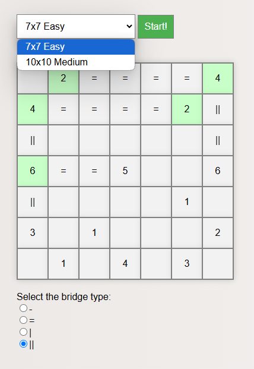

# Hashiwokakero Puzzle

Bridges (Japanese: Hashiwokakero; [Puzzle Bridges](https://www.puzzle-bridges.com/)) is a puzzle played on a square grid with the following rules:

- At the start, some cells of the grid contain a natural number between 1 and 8. These cells represent islands. No two islands are adjacent on the grid (adjacent means left, right, up, or down).
- Two islands that are in the same row or column, and are separated by empty cells, can be connected by a single or double bridge. After connecting, the cells between those islands are no longer empty but are occupied by the newly constructed bridge.
- The goal of the puzzle is to build bridges so that:
  - The number of bridges connected to each island must match the number on that island. Single bridges count as one, and double bridges as two.
  - From each island, it is possible to reach any other island via bridges.

This application is a web-based implementation of the Hashiwokakero puzzle, which includes an interactive grid.

## Screenshot

## Usage Instructions
1. Clone or download the repository.
2. Open the `hashiwokakero.html` file in your browser.
3. Start solving puzzles!

## How To Play
- The player is able to select one of the puzzles using a dropdown menu.
- By clicking the "Start!" button (at any point), a grid is drawn with the initial state of the selected puzzle. Initially, only numbers are displayed in the grid.
- The player can use radio buttons to choose whether to build single or double bridges, as well as horizontal or vertical bridges.
- A left mouse click on an empty cell in the table connects the two islands with the selected type of bridge, provided they meet the already described conditions (all cells between those two islands are empty; the clicked cell is one of those empty cells; the selected type of bridge is horizontal if those two islands are in the same row, and vertical if they are in the same column).
  - If such islands exist, all cells between them are filled with the selected type of bridge.
  - If such islands do not exist, a message indicating invalid move is displayed.
- A right mouse click on a cell with a bridge deletes the entire bridge.
- When the number of bridges connected to an island equals the number on that island, the background color of that island is changed to green.
- After a successful completion of the puzzle, an appropriate message is automatically displayed.

## Technologies Used
- HTML
- CSS
- JavaScript
- jQuery

## Puzzle Source
The puzzles used in this project were sourced from [Puzzle Bridges](https://www.puzzle-bridges.com/). 

## Contribution
If you would like to contribute to this project, feel free to open an issue or submit a pull request.

## Possible Improvements and Enhancements

There are several features and improvements that could be added to enhance the functionality and user experience of the Hashiwokakero puzzle app:

- **Additional Puzzle Sets**: Add more puzzles to `puzzle.js`, possibly sourced from an API or a custom database, to give players a wider variety of challenges.
- **Undo/Redo Functionality**: Allow players to undo and redo their previous moves, which can be particularly helpful for correcting mistakes without restarting the puzzle.
- **Timer and Scoring System**: Track the time and the number of moves taken to complete each puzzle and display it to the player.
- **Improved Graphics and Animations**: Enhance the visual appeal of the grid, islands, and bridges with improved graphics.
